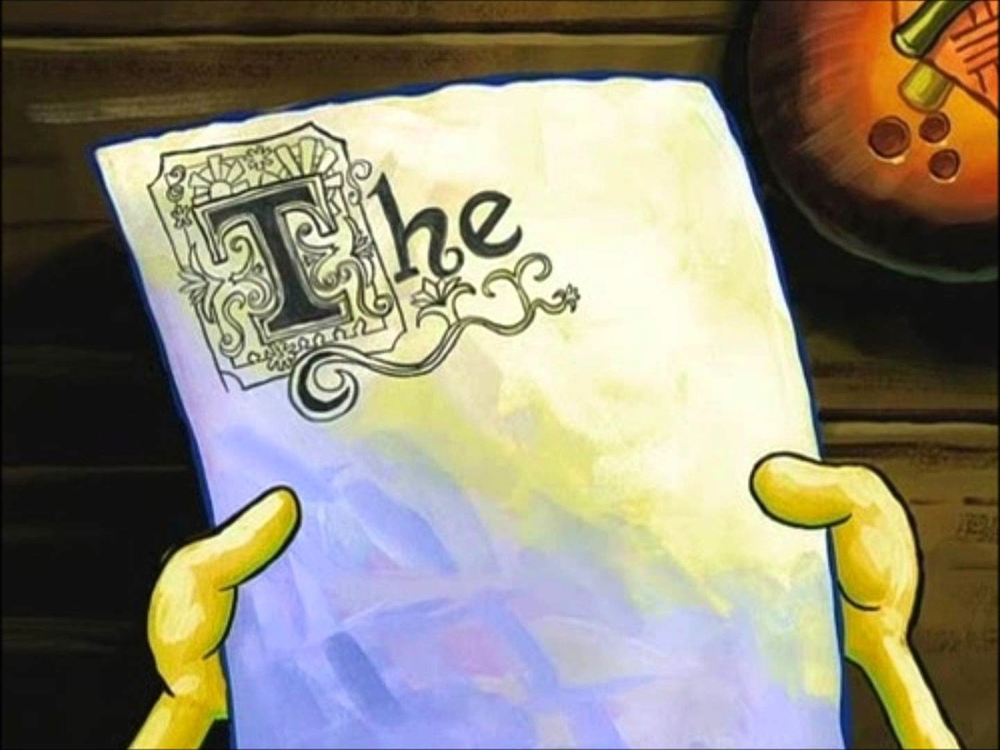

# Bikini Bottom Election - Part 1


## Overview
Bikini Bottom needs a new mayor. And it's up to the brave students of Bitmaker to bring the vote to the people.

This assignment has two parts:

1. Listing out the current election results
1. Allowing the user to vote.

We'll be doing the first part today, in this assignment, and the second part tomorrow.

We're providing you with a server to interact with for this assignment. You'll be communicating with it through a JSON API.  The API will give you the current election results, and allow you to submit a vote.

It's up to you to build a wonderful frontend for this API. You will be writing exclusively client-side code for this assignment, no Rails app.

Let's get started!



## Setup and Review
**First**, I recommend installing a browser addon to help you test making requests to the API. You can always use the command line program `curl` to make requests, but it can be a little intimidating.

A couple great choices are [Postman](https://www.getpostman.com/), which has both a Chrome App and native Mac App, or [RESTClient](https://addons.mozilla.org/en-US/firefox/addon/restclient/), an addon for Firefox.

**Second**, go ahead and fork the repo at https://github.com/bitmakerlabs/bb-election-part-1, where you'll find the skeleton of the frontend you'll be building.

**Third**, make sure you understand the various parts of a request. Here's a quick review. When you make a request:
1. There's a **method**: `GET`, `POST`, `PUT`, `PATCH`, or `DELETE`. We'll be using `GET` to retrieve data, and `POST` to submit data.
1. The **url**, broken down into three parts: `host`, `path`, and `query string`
  + The **host** is the part of the url that doesn't change on a website.  If you go to https://alexa.bitmaker.co/weeks/current, the host is `alexa.bitmaker.co`
  + The **path**, or the route we're taking in the website. In https://github.com/bitmakerlabs/bb-election-part-1, the path is `/bitmakerlabs/bb-election-part-1`
  + The **query string** contains additional parameters not in the path.  In https://www.google.ca/search?q=spongebob, the query is everything after `?`, `q=spongebob`
1. The **body**. In a `GET` request, the body is empty, but in a `POST`, it'll contain data. This data can be in multiple formats, but today it'll all be JSON, like this: `{ "key" : "value" }`

There are other parts as well, but this is what you'll need for this assignment.

The server you'll be interacting with is deployed at:
+ https://bb-election-api.herokuapp.com/

If you go to it now in your browser, you'll see some lovely JSON data!

## Listing Current Results


As you may have already seen if you went to the API in your browser, our first endpoint, the one that returns election results, lives at **the root of our API**, or `/`.

Making a `GET` request to `https://bb-election-api.herokuapp.com/` is going to return a bunch of JSON data to us, that'll look something like this:
```json
{
  "candidates": [
    {
      "id": "577805c3e30089e66c1ede16",
      "name": "Spongebob",
      "votes": 2
    },
    {
      "id": "577805c3e30089e66c1ede18",
      "name": "Squidward",
      "votes": 1
    },
    {
      "id": "577805c3e30089e66c1ede19",
      "name": "Sandy",
      "votes": 0
    },
    {
      "id": "577805c3e30089e66c1ede17",
      "name": "Patrick",
      "votes": 0
    },
    {
      "id": "577805c3e30089e66c1ede1a",
      "name": "Gary",
      "votes": 1
    }
  ]
}
```

Let's think about what's being returned. The response contains an array called `candidates`, which contains an object representing each candidate in the election. Each one has:
+ An `id`
+ A `name`
+ A `votes` count

**NOTE:** If you're observant, you may have noticed that the ids look a little different than what you're used to seeing. That's because the server uses MongoDB as a database instead of Postgres or SQLite like normal, and the ids are [hex strings](https://en.wikipedia.org/wiki/Hexadecimal) instead of numbers. Don't stress out about this, to the frontend, **it doesn't actually matter** what technology the server is using, it not going to change how we interact with the server, except that our ids will be `Strings` instead `Numbers`.

Ok, so we can make a `GET` request to our server and get a bunch of data back, but what do we do with this data?

### TODO
1. In the `election.js` file, build an AJAX request that makes a `GET` request to the root path, and expects a JSON response.
  + *Make sure you're making this request within your `$(document).ready` block*
1. Add a `<ul>` to your `index.html` file, with an id.  This is what we'll attach our data to.
1. In the `.done(function(responseData){})` **callback function** for the AJAX request loop over the candidates in `responseData`, and [append](http://api.jquery.com/append/) a `<li>` element for each candidate into the DOM at our `<ul>` from the last step. You'll want to show the `name` and `votes` count of each candidate.
1. Add a **"Refresh"** button or link to the `index.html` file. Create a `click` event handler for this button in `election.js`. When it's clicked, update the vote counts of the various candidates. You'll have to update the existing `<li>` elements now instead of appending.
1. **STRETCH:** Since we're making the same AJAX request in two seperate places, when we load the page and when we hit **"Refresh"**, DRY up your code a bit by putting this AJAX call into a function that we can call.

### To be continued?
That's it for today. Tomorrow in [Part 2](https://github.com/devonoel/bb-election-part-2) we'll pick up where we left off, and add voting to our app.

